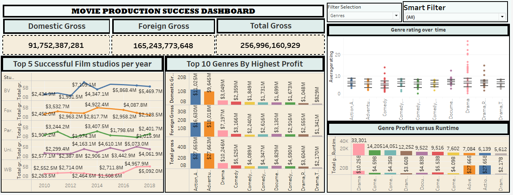

# Movie-Production-Success- Project

**INTRODUCTION**

This project seeks to analyze current box office trends to inform on the strategic decisions of our new movie studio. By utilizing data from various sources, we plan to focus on which types of films are presently excelling at the box office and turn these insights into practical strategies.

**Objectives**
1. Identify the Highest Grossing Films: Determine which movies are generating the most revenue at the box office.
2. Determine the Most Common Genres Among Top-Grossing Movies: Examine the dominant genres among the highest-earning films.
3. Analyze the Correlation Between Box Office Performance and Movie Ratings: Explore the relationship between movie ratings and their box office success.
4. Identify the Most Successful Film Studios: Identify the studios responsible for producing the most successful films.

**Data Sources**
The datasets used in this project are from various sources, including:

* im.db.zip: Zipped SQLite database containing movie_basics and movie_ratings tables.
* bom.movie_gross.csv.gz: Compressed CSV file with box office gross information.
* IMDB
* Rotten Tomatoes
* TheMovieDB
* The Numbers

**Project Steps**
1. Data Extraction and Cleaning
* SQLite Database:
>> Extracted and cleaned data from movie_basics and movie_ratings tables.
>> Dropped rows with null values in crucial columns like original_title and genres.
>> Merged the tables on the movie_id column.
* CSV File:
>> Loaded and cleaned bom.movie_gross.csv.gz.
>> Removed commas and converted the foreign_gross column to numeric.
>> Filled missing values in foreign_gross with the median of the column.

2. Data Merging
>> Merged the cleaned data from the SQLite database with the cleaned CSV data using the title and year
columns.

3. Feature Engineering
>> Created new columns like total_gross by summing domestic_gross and foreign_gross.
>> Condensed filters using parameters for a more user-friendly dashboard experience.

4. Visualization and Analysis
>> Generated key visualizations to meet project objectives:
>> Bar charts and line graphs to identify highest-grossing films.
>> More charts to identify the most successful film studios.

5. Dashboard Creation
>> Created an interactive dashboard in Tableau, including using Key Performance Indicators (KPIs).
>> Smart filters using parameters.
>> Interactive visualizations to explore data insights.

**Dashboard Visualizations**
1. Key Performance Indicators 

2. Top 10 Genres with highest profits.

3. The most successful film studios

4. Profits from genres versus their runtime minutes

5. Genre rating over time

**RECOMMENDATION**
1. High Performing Genres
>> There are a certain genres that outperfrom other genres and have proven to have strong box office returns and large audience.
>> I would recommend we prioritize production in high-performing genres such as Action, Adventure, and Animation.

2. Partner with successful Studios
>> I would recommend to establish collaborations with successful studios that I have identified. This allows us to leverage their expertise and increase the likelihood of success.

3.  Invest in Marketing and Promotion
>> It is notable that for a movie to be successful they have to invest heavily on marketing strategies.
>> I would recommend we allocate more budget for marketing and promotion to attract a wider audience. Utilize social media & influencers to create buzz and drive interest.

**Contact**
For any questions or further information, please contact [PETER MAINA] at [mpwanyoike@gmail.com].